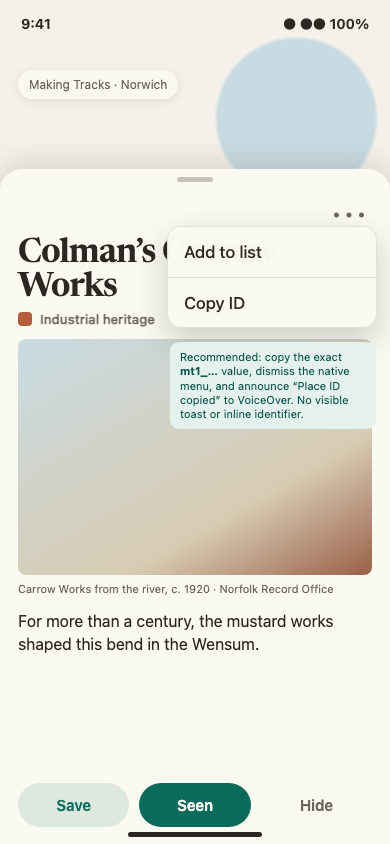
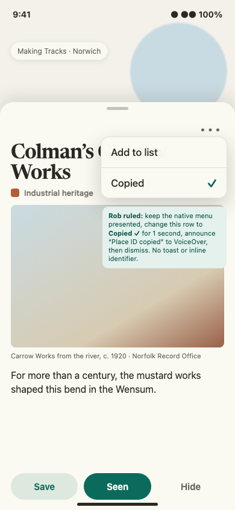
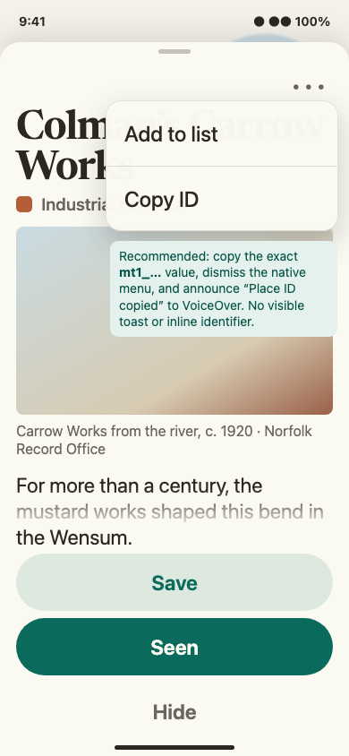
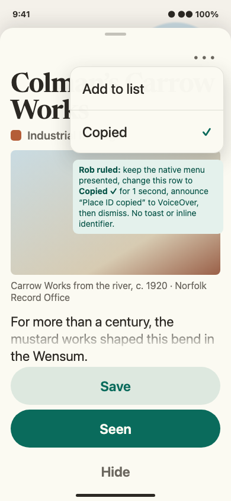

# #375 Copy ID menu — ruled confirmation packet

Status: **ROB RULED / REVIEWER VALIDATED / IMPLEMENTATION AUTHORIZED**. Rob selected an in-row confirmation flash on 2026-08-06. The live-menu feasibility gate passed, and the reviewer validated the four-frame delta at exact head `1b38164` with no findings. No further Rob roundtrip is required.

Evidence class: **Deterministic fixture.** SHA-256 is the byte-reproduction oracle.

## Request and ruling

Add a `Copy ID` action to the existing place-card ellipsis menu so a person reporting a problem can copy the exact `mt1_…` place identifier without exposing it in the card hierarchy.

Rob ruled that activating the row keeps the native menu presented, changes that row to `Copied` with a checkmark for a bounded one-second confirmation, announces `Place ID copied.` to VoiceOver, and then dismisses the menu. There is no toast or inline identifier. The next menu presentation starts again at `Copy ID`.

## Grounded surface and feasibility

`PlaceCardSheet.header` currently renders a native SwiftUI `Menu` behind the 44×44 `place-card.more` control. Its only row is `Add to list`; no clipboard or copy-confirmation pattern exists in app code. The surrounding card, action bar, detents, and More glyph stay unchanged.

The deployment target is iOS 18. The installed public SDK supports both SwiftUI `menuActionDismissBehavior(.disabled)` and UIKit `UIMenuElement.Attributes.keepsMenuPresented`. SwiftUI can keep a menu open but exposes no public handle for dismissing that live menu after a delay. UIKit's public path does: a menu-owning `UIButton` exposes its `contextMenuInteraction`, whose visible menu can be updated and dismissed. The implementation design therefore retains the current SwiftUI More glyph while a transparent UIKit-backed button owns the native menu interaction. No private introspection is required.

## Alternatives considered

1. **UIKit-backed native menu — selected.** Keep the action presented with `keepsMenuPresented`, replace the visible action with a disabled `Copied` checkmark state, then dismiss through the public context-menu interaction after the bounded delay. This preserves native menu behavior and implements Rob's exact ruling.
2. **SwiftUI `Menu` only.** `menuActionDismissBehavior(.disabled)` keeps the menu presented, but SwiftUI exposes no public delayed-dismiss handle. Removing or replacing the anchor to force dismissal would be lifecycle-dependent and is rejected.
3. **Custom SwiftUI popover.** It can model the timing directly, but replaces the requested native menu and expands layout, interaction, and accessibility scope. It is rejected.

The earlier pre-ruling packet also compared silent native dismissal, a toast, and an inline ID. Rob's in-row flash supersedes all three feedback choices.

## Ruled contract

- Default row: `Copy ID`, ordered after `Add to list`.
- Payload: copy the exact `placeID` string, including the `mt1_` prefix; add no name, label, newline, or diagnostic wrapper.
- Activation: write the pasteboard immediately, announce `Place ID copied.` to VoiceOver, and keep the native menu presented.
- Confirmation: update the visible row to disabled `Copied` with a trailing checkmark for one second. The checkmark supplements the text and is not the sole state signal.
- Completion: dismiss the menu after the confirmation interval and reset the next presentation to `Copy ID`.
- Stable identifiers: preserve `place-card.add-to-list`; add and verify `place-card.copy-id` on the live UIKit menu route.
- Testability: inject the delay and side effects so unit tests advance deterministically; production and UI tests must not sleep to observe state.
- Scope: no toast, inline identifier, card layout, action bar, detent, data-model, persistence, analytics, or network change.

## Constraint and accessibility record

All four frames are exactly 390×844 CSS pixels. The default pair retains the current 44×44 More target and three-button action row. The AX pair enlarges the More target to 52×52, depicts illustrative native-menu geometry, enlarges the card title to 44pt, and uses 64pt stacked action rows. Native menu-row dimensions are **illustrative, not ratified** because UIKit owns them. Implementation evidence instead gates the app-owned properties: `place-card.more` remains at least 44×44 at default and retains its AX enlargement; `Add to list` precedes `Copy ID`; the presented menu remains fully onscreen through AX5; and both actions remain exposed to accessibility and activate with the success announcement on Copy. On 2026-08-07, iOS 26.5 rendered each native row at 250×42pt at default and 370×126pt at AX5. Those dated measurements are observed platform facts, not thresholds.

VoiceOver must encounter `Add to list`, then `Copy ID`; activation announces success without reading the long identifier aloud. The confirmation state exposes the word `Copied`, not only a checkmark. The raw ID reaches the system pasteboard only after an explicit user action. The transition replaces menu content without motion, so Reduce Motion needs no alternate animation.

## R16 proof-absence record

The filled `Seen` control in these frames reports an ON state under R16; it is not a filled action. The render preserves A2's shipped R15 morphology—tonal means available, filled means on, and quiet means a momentary verb—so it introduces no filled action beside the state cluster. **this surface does not pair a filled action with a state cluster; the R16 proof obligation travels to the first surface that does.**

| Default menu | Default confirmation |
|---|---|
|  |  |

| Accessibility-size menu | Accessibility-size confirmation |
|---|---|
|  |  |

## Reproduction

Run `./scripts/render-375-copy-id.sh`. The deterministic-fixture packet uses Chromium 151.0.7922.34 at device scale factor 1 and captures the HTML source directly at 390×844. A repeated four-frame render must reproduce every file byte-for-byte; the original pre-ruling pair remains unchanged.

- `375-copy-id-menu.png`: `868bd85fa2267c24ada1e9da2fa8b30a3c2627e32808b03c98863ebf87a89ff1`
- `375-copy-id-menu-ax.png`: `682d7c353def9e46a14fe0a1cf3ac93b29f05105cd2b2f65feb075f7fa31530d`
- `375-copy-id-menu-copied.png`: `0841e932f93eb2690b38b3feb608831079c27b03f9289a71b72eed6f1d53d5b0`
- `375-copy-id-menu-copied-ax.png`: `193f68b7b47c757cecc835a2538366f3a5d52e831a686e0ea10c21c38c4d2419`
