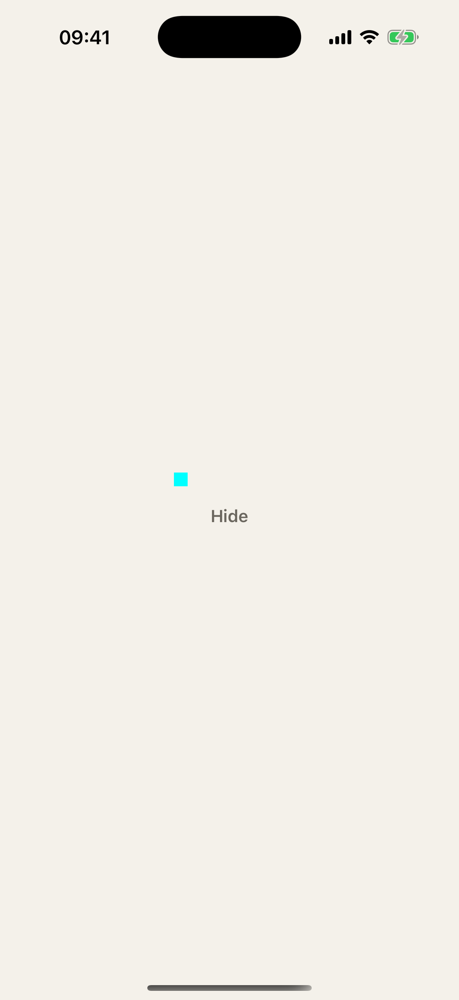
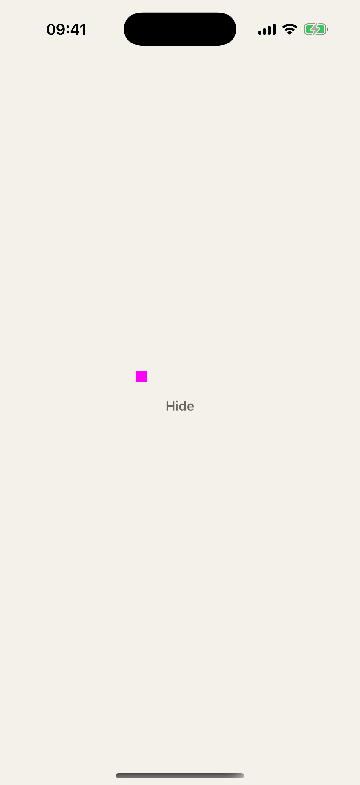
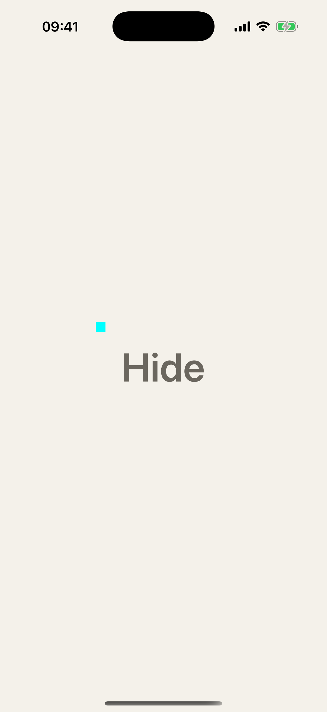
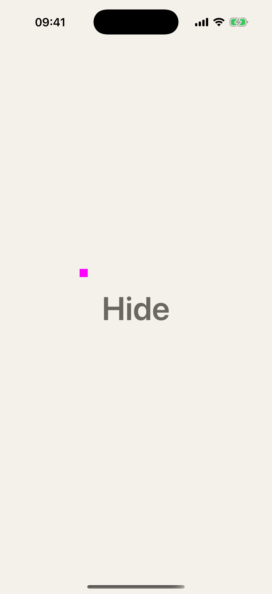

# Place-card quiet-action press-inset evidence

**Evidence class: Deterministic fixture.** This packet records the production
quiet text-only Hide action at default and accessibility text sizes. It was
captured from exact source head
`500b36a57b105609f369a7b8f82c5f4406490aba` through simulator seat `codex4`,
destination
`platform=iOS Simulator,id=42D1482C-DE04-49AA-990D-1884ED9B855D`.

## Device measurements

Every bounds value is in device pixels and is written as `x,y,width,height`.
The displacement columns compare the pressed frame with the rest frame from
the same text-size run. The state marker is capture metadata: the analyzer
classifies its exact live cyan/magenta pixels, then excludes the marker's
exported pixel rectangle from semantic text-ink measurement.

### Default text size

| State | Capture | Dimensions | Dark ink pixels | Ink bounds | Top / centre displacement | SHA-256 |
|---|---|---:|---:|---|---:|---|
| Rest |  | 1206×2622 | 1,099 | `557,1335,93,34` | baseline | `9c266bef8f6cf143c81f660d06dd572c580e5bc7f2e28e0deb65d9edd7e345c3` |
| Pressed |  | 1206×2622 | 874 | `558,1339,91,32` | `+4 / +3.0` | `5915548052aff695ee192c9be85fce9a960d86fba992eeedd870eed5b4ce2351` |

### Accessibility text size

| State | Capture | Dimensions | Dark ink pixels | Ink bounds | Top / centre displacement | SHA-256 |
|---|---|---:|---:|---|---:|---|
| Rest |  | 1206×2622 | 12,884 | `459,1299,292,107` | baseline | `3d4ecb259062a447d1c671f5764b5d8c70311f4284a931feb63cb73db608bd96` |
| Pressed |  | 1206×2622 | 11,824 | `462,1309,286,105` | `+10 / +9.0` | `64ad7119d54751cd249dcc46332b0a9ee546d480a59dec0611587b3236e25d6f` |

The default top displacement is positive (`4` device pixels), and the
accessibility displacement is strictly larger (`10` device pixels).

## Capture method and environment

The runner built the app in Release and built the focused tests in Debug. The
default invocation ran the production quiet-action mounting test, the evidence
wrapper delegation test, and the default-size UI capture test; it reported
`3 passed, 0 failed`. The accessibility invocation ran the accessibility-size
UI capture test and reported `1 passed, 0 failed`. Each UI test first required
the live marker to say `rest`, exported the real Hide button and state-marker
frames plus screen scale, then issued 80 real `XCUIElement.tap()` events. While
the taps ran, the wrapper-owned capture worker sampled the simulator display.
Selection required an exact cyan rest marker and exact magenta pressed marker
before measuring the production quiet text.

- Xcode: `26.6` (`17F113`)
- Swift: `Apple Swift 6.3.3 (swiftlang-6.3.3.1.3 clang-2100.1.1.101)`
- Swift driver: `1.148.6`
- Swift target: `arm64-apple-macosx26.0`
- Focused tests: default `3 passed, 0 failed`; AX `1 passed, 0 failed`

## Reproduction oracle

The four PNG SHA-256 digests above are byte-reproduction oracles. A clean
baseline regeneration and the unchanged final regeneration at the same source
head produced the same four digests byte-for-byte. All three mutation runs
failed before packet installation, and the installed packet retained the same
digests after every cleanup. The final unchanged packet is the packet installed
here.

## Mutation teeth

Three temporary production-adjacent mutations proved the live oracle fails for
the intended reasons. Each mutation was applied with `apply_patch`, run through
the locked `codex4` regeneration command, restored exactly, checked with
`git diff --exit-code`, and followed by the final green normal regeneration.

1. Bypassing the shared resolver only in the production quiet mount made the
   Hide and Unhide production-mount assertions fail while the evidence-wrapper
   delegation test remained green. The runner exited nonzero with
   `regenerate-place-card-press-inset: focused default test command failed gate_status=65`.
2. Replacing the scaled text inset with the unscaled one-point base made the
   runner exit nonzero with
   `regenerate-place-card-press-inset: AX displacement must exceed default`.
3. Forcing the DEBUG live state marker to report rest regardless of
   `configuration.isPressed` made selection exit nonzero with
   `measure-place-card-press: missing valid exact pressed marker; rejected 11 candidates`.

The Task 4 full host gate was deliberately not run during this capture task.
Its reserved exact command is:

```bash
./scripts/sim-lock.sh --seat codex4 ./scripts/release-gate.sh
```

Regenerate this focused packet with:

```bash
MT_RELEASE_GATE_DERIVED_DATA=$HOME/Library/Caches/making-tracks-gates/codex4 ./scripts/sim-lock.sh --seat codex4 ./docs/design/design-system/regenerate-place-card-press-inset.sh
```
