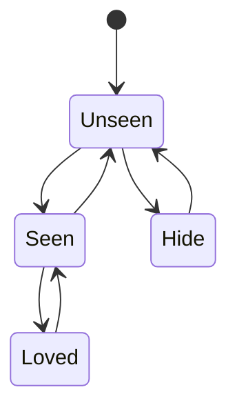
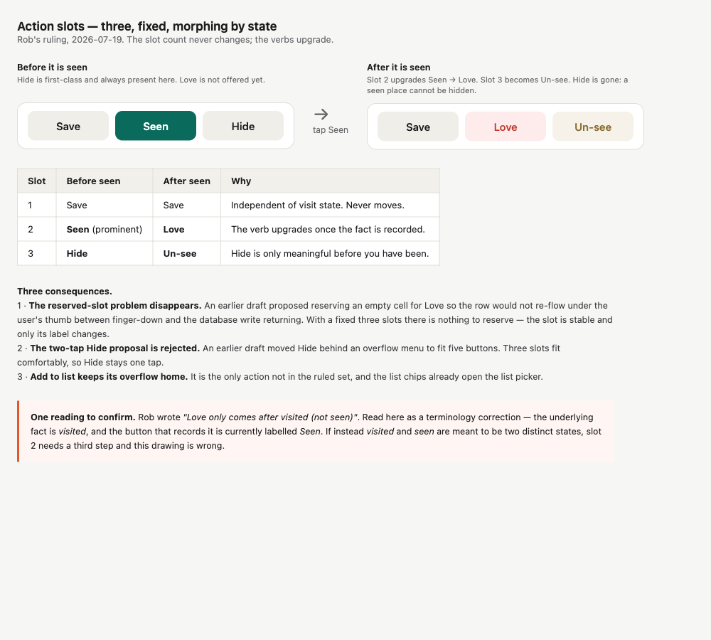

# WP-CARD-LAYOUT — place card

**Status: DESIGN. Visual pass, for Rob's read.** Supersedes the first attempt, whose premise he rejected.

## 1. The model

Rob's hierarchy, from #171:

> "prominent name / type / description / photo / lists; attribution small at bottom + outbound link."

Rob's interaction model, 2026-07-19:

> "whats wrong with scrolling the card? Get a proper visual/IA design done first but seems reasonable? The toast shows the photo, a taster etc then you slide up to full screen then scroll if needed."

Three states: **peek → slide up → scroll**. Scrolling is not a defect. The first draft of this design treated it as one and argued the core loop must never be scrolled to. That was a product judgement Rob had not made, and it is withdrawn.

## 2. The device floor

Rob, 2026-07-19: *"we support ios18 but cant really keep designing to out of date os versions."* The resolution is two-tier:

- **Deployment target stays iOS 18.** Old devices keep running the app. Compatibility is unchanged.
- **The design floor is what Apple currently sells.** We optimise there.
- **Everything between gets graceful degradation verified, not optimised.** The layout must not break; it need not be tuned.

**The OS-version argument does not move the floor.** iOS 27 drops no devices relative to iOS 26, and the smallest screens supported by iOS 18 are supported by iOS 27 too. Only the *still-sold* criterion raises it.

| Criterion | Smallest by height | Smallest by width |
|---|---|---|
| Runs iOS 18 (deployment target) | 667 pt — iPhone SE 2nd/3rd gen | 360 pt — iPhone 12/13 mini |
| Runs iOS 26 (current) | 667 pt — same | 360 pt — same |
| Runs iOS 27 (incoming) | 667 pt — same | 360 pt — same |
| **Apple still sells** | **844 pt — iPhone 17e** | **390 pt — iPhone 17e** |

**Design canvas: 390×844 pt** (iPhone 17e). **Degradation floor: 360×667 pt composite** — no real device is that size; the two real stress cases are 360×780 (mini, narrowest) and 375×667 (SE, shortest).

Sources: [iOS 18 compatibility](https://support.apple.com/guide/iphone/iphone-models-compatible-with-ios-18-iphe3fa5df43/18.0/ios/18.0) · [iOS 26 compatibility](https://support.apple.com/guide/iphone/iphone-models-compatible-with-ios-26-iphe3fa5df43/ios) · [iOS 27 device list](https://www.apple.com/os/ios/) (Apple-published but pre-release — treat as provisional) · [HIG layout / screen sizes](https://developer.apple.com/design/human-interface-guidelines/layout) · [current lineup](https://www.apple.com/shop/buy-iphone).

Two corrections worth recording. The first draft of these wireframes used **375×667 (iPhone SE)** as the canvas — wrong per the ruling above. And the iPhone mini is **360×780 pt**, not 375×812: Apple's HIG table is authoritative and several third-party spec sites disagree with it. So the true width floor is narrower than the SE, not wider.

Apple publishes no minimum supported screen size. The HIG's only relevant guidance is about *testing* at the largest and smallest layouts, which maps onto this two-tier position exactly: design at 390×844, test at 360×780 and 375×667.

## 3. The wireframes

### Default text size

### Accessibility text size (AXXXL)

Sources are committed beside the images (`docs/design/card/wf-default.html`, `wf-ax.html`) so they can be re-rendered and edited rather than redrawn.

## 4. The actions — ruled

Rob, 2026-07-19:

> "where's hide? Hide is a first class action. Love only comes after visited (not seen). So - Save, Seen (change to loved on seen) Hide."

> "Also on seen, change hide to unsee or something - you can't hide a seen item."

And the state machine, authored by Rob, verbatim:

**Three fixed slots across three states. The count never changes; the verbs do.**

| Slot | Unseen | Seen | Loved |
|---|---|---|---|
| 1 | Save | Save | Save |
| 2 | **Seen** (prominent) | **Love** | **Unlove** |
| 3 | **Hide** | **Un-see** | *disabled* |

### The two edges the diagram omits

These are the load-bearing part, and they are omissions rather than statements — easy to miss and easy to violate by accident.

**There is no `Loved --> Unseen`.** So slot 3 is disabled in the Loved state. Un-seeing a loved place takes two deliberate steps: unlove, then un-see. A single tap cannot discard the stronger record.

**There is no `Hide --> Seen`.** Unhiding returns a place to Unseen, never straight to Seen. Hiding is not a route to recording that you have been somewhere.

### What this settles

- **Terminology.** One ladder — Unseen ⇄ Seen ⇄ Loved — with Hide as a side branch off Unseen. There is no separate *visited* state distinct from *seen*. The question raised in the previous revision is answered.
- **Hide is first-class.** The proposal to move it behind an overflow, and the "Hide becomes two taps" ratification item, are withdrawn.
- **The reserved-slot problem dissolves.** An earlier draft reserved an empty cell so the row would not re-flow under the thumb between finger-down and the write returning. With a constant three slots there is nothing to reserve.
- **Add to list** is the only action outside the ruled set and keeps its overflow home; the list chips already open the picker.

**Data-layer note.** "You can't hide a seen item" governs what the card offers, not a migration. Existing hidden-and-visited rows are legacy composition in the fade matrix and are unchanged.

## 5. The source link and the credit

Rob, 2026-07-19:

> "the link at the bottom of the text. There should be a link to the wikipedia (or source) article - remember, might be any source (historic england, whatever). The licence terms are just printed text."

This splits the attribution question in two.

**One outbound link: the source article.** It sits at the end of the description text, and it is **source-agnostic** — driven by the entry's own provenance, not written against Wikipedia. Historic England, Open Plaques, OpenStreetMap and Wikipedia all reach the card by the same path, so the link is built from the source metadata and labelled from it.

**The photo credit stays inert.** Creator, licence and modified-flag render as printed text. No licence hyperlink.

Consequence for the shipped code: the photo credit currently ends with the full licence URL as text (`PlaceImageAttribution.displayText`). Under this ruling the URL comes out of that string — the licence is named, not linked. That is an iOS-side follow-up against #235, not part of this design.

### The `privacy.md` question — for ratification, not resolved here

`privacy.md:84` reads:

> "We treat all of it as untrusted: checked, size-limited, and shown as plain text, so a bad entry in a public database can't harm your phone."

A tappable source link is the one place the card stops treating source data as plain text. The protection the sentence promises is still delivered — the URL is validated, https-only and host-checked before it is offered — but the sentence as written does not describe what the card would do.

Proposed one-line amendment, for Rob's ratification:

> "We treat all of it as untrusted: checked, size-limited, and shown as plain text — with one exception, a link to the original source article, whose address we validate before showing it. A bad entry in a public database can't harm your phone."

If he prefers the commitment unchanged, the link does not ship and this section reduces to shortening the credit line.

## 6. What the pictures show

**Peek carries the decision.** Name, type, photo, one taster line. On the evidence of the default-size render, that is enough to decide "worth a look" without expanding. The map stays usable behind it.

**Slid up, with a short description, the sheet is mostly empty.** Panel 2 at default size is honest about this: the content does not fill the height. That is an argument for the peek doing the work, not against the model. It also means the slide-up earns its place only when there is something to reveal — which is the case once full descriptions ship.

**At accessibility sizes the photo still does not fit in peek**, even on the larger canvas. A two-line name, the type row and three stacked buttons fill it. Fitting the photo needs peek at roughly 85% of the screen, which stops being a peek.

This finding was first derived on the wrong canvas, and it survived the correction — but it was re-derived, not carried over. On the corrected canvas it is a closer call than it was.

**Actions are drawn as a fixed bottom bar** in every panel, with content passing behind it. §8 records the ruling.

## 7. What the pictures cannot settle

Panel 3 of the accessibility render approximates today's card. **It is not a measurement**, and in the wireframe the actions look reachable — which contradicts the UI test, where `scrollToExistence` is required for Save, Seen and Love at AXXXL.

One of those is wrong and a mockup cannot say which. **Measure on a device before any decision that depends on it.** The first draft of this design built its entire argument on the test evidence without checking it against a rendering, which is how it reached a conclusion Rob rejected.

## 8. Where the actions live — ruled

Rob, 2026-07-19:

> "yes fixed actions across the bottom, toast slides up behind almost"

**A fixed bar across the bottom.** The actions leave the content spine. The question is closed.

**The bar is the stationary layer.** Content slides and scrolls *behind* it — the sheet rises from the peek state passing under the bar, and the description scrolls under it. The bar does not move with the content and is not part of the scroll.

Two things follow for the build:

- **The content needs a bottom inset equal to the bar**, so the end of the attribution can still clear it rather than resting permanently underneath.
- **The edge where content passes behind the bar needs treatment** — a fade or clip, so text does not simply vanish at a hard line. The wireframes draw a fade.

This also settles the ordering item: the bar sits below attribution in screen coordinates, inverting `chips < actions < attribution` in the order-teeth test. The six content elements keep Rob's order among themselves; the actions are no longer part of that sequence.

## 9. Constraints any option must answer

Carried from the research pass. These do not depend on which option wins.

- **VoiceOver order.** A pinned bar reads last by default. Needs `accessibilitySortPriority`, or the accessibility story contradicts the visual one.
- **Action completion is silent.** Every tap awaits a DB write with no optimistic update and no announcement. Pinning makes the latency more visible; it does not cause it.
- ~~Love's reserved slot~~ — resolved by the three-slot morph in §4. The row no longer grows.
- **The photo is a hard 180pt** that does not scale with Dynamic Type, so it shrinks proportionally as text grows. The wireframes draw it scaled; the code does not do this today.
- **The late-photo jump is block insertion, not byte arrival.** Bytes load into a fixed box with a spinner. The jump happens when `card.photo` flips nil to non-nil and the whole slot appears in an open card.
- **The outbound link is ruled** — see §5 above. The remaining question is the `privacy.md` wording, not the design.
- **List chips are ~26–28pt against a 44pt tap target**, and there is no tap-target rule anywhere in this codebase to point at.
- **No contrast test exists.** Any coloured text this design adds — the attribution link — is the first place the committed WCAG AA 4.5:1 is visibly on the line.
- **`altNames` is decoded and never rendered.** Dead data either way.

## 10. Test delta

Unchanged from the analysis pass, and it only bites if option A wins.

- Pinning inverts `chips < actions < attribution` in `testPlaceCardOverhaulRendersHierarchyAndHideAction`. That is a change to a hierarchy Rob signed off and needs saying, not absorbing.
- The Hide-behind-overflow change is withdrawn (§4), so `hideButton.exists` / `.tap()` are unaffected.
- New cases owed by the state machine: slot 2 reads Seen / Love / Unlove across the three states; slot 3 reads Hide / Un-see / disabled. The disabled case is the one worth teeth — a test that Un-see cannot be invoked from Loved, which goes red if someone "helpfully" adds the missing `Loved --> Unseen` edge.
- The order test does not include `place-card.add-to-list` at all. That is how it drifted in unnoticed after #231, and it should be added regardless of which option wins.

The six content elements keep their order in every option. Only the actions move.

## 11. What was withdrawn from the first draft

Recorded so it is not re-derived.

- **"The core loop is below the fold, therefore ceremony."** The observation stands; the verdict does not. Principle 3 says one tap, no ceremony. It does not say zero scroll.
- **The pinned bar as the thesis.** Demoted to one option among three.
- **The device canvas.** The first renders used 375×667 (iPhone SE). Wrong per §2. The renders were rebuilt rather than relabelled, and the one finding that depended on the canvas was re-derived rather than carried across.
- **The panel's ranking.** The four-layout analysis scored progressive disclosure last, at 18/40 — and progressive disclosure is Rob's model. The judges' main objection was that the compact state ends at a clean edge because no description renders in production. That was true on the day and is expiring: blurb emission is now commissioned. The brief fed the panel a temporary constraint without marking it temporary, so the panel optimised against a data gap. The analysis is retained in the PR history as evidence, not as the deliverable.
