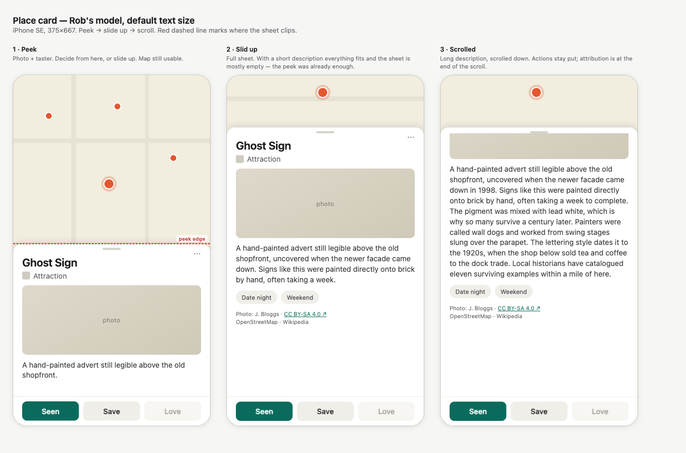
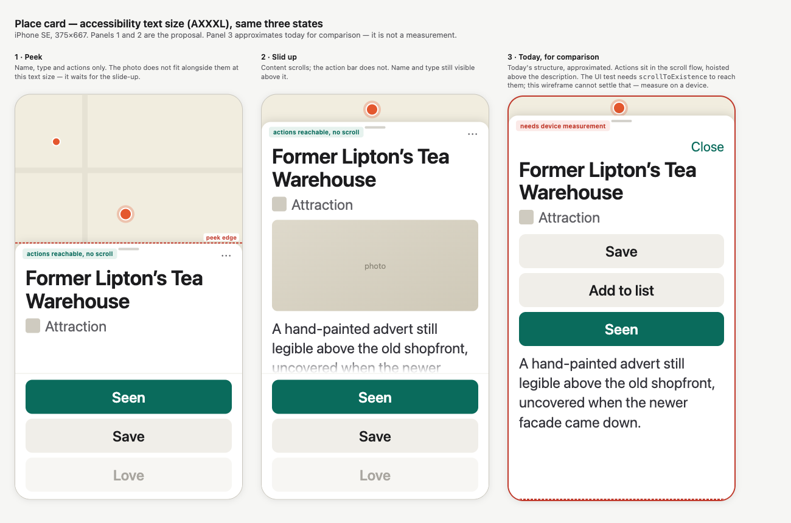

# WP-CARD-LAYOUT — place card

**Status: DESIGN. Visual pass, for Rob's read.** Supersedes the first attempt, whose premise he rejected.

## 1. The model

Rob's hierarchy, from #171:

> "prominent name / type / description / photo / lists; attribution small at bottom + outbound link."

Rob's interaction model, 2026-07-19:

> "whats wrong with scrolling the card? Get a proper visual/IA design done first but seems reasonable? The toast shows the photo, a taster etc then you slide up to full screen then scroll if needed."

Three states: **peek → slide up → scroll**. Scrolling is not a defect. The first draft of this design treated it as one and argued the core loop must never be scrolled to. That was a product judgement Rob had not made, and it is withdrawn.

## 2. The wireframes

### Default text size

### Accessibility text size (AXXXL)

Sources are committed beside the images (`docs/design/card/wf-default.html`, `wf-ax.html`) so they can be re-rendered and edited rather than redrawn.

## 3. What the pictures show

**Peek carries the decision.** Name, type, photo, one taster line. On the evidence of the default-size render, that is enough to decide "worth a look" without expanding. The map stays usable behind it.

**Slid up, with a short description, the sheet is mostly empty.** Panel 2 at default size is honest about this: the content does not fill the height. That is an argument for the peek doing the work, not against the model. It also means the slide-up earns its place only when there is something to reveal — which is the case once full descriptions ship.

**At accessibility sizes the photo does not fit in peek.** Name and type alone consume the peek height. The photo waits for the slide-up. That is a real consequence of Rob's model at large text and it should be a conscious choice, not a surprise.

**Actions are drawn pinned in all four proposal panels.** That is one option, shown so it can be compared, not a conclusion. §5 prices it.

## 4. What the pictures cannot settle

Panel 3 of the accessibility render approximates today's card. **It is not a measurement**, and in the wireframe the actions look reachable — which contradicts the UI test, where `scrollToExistence` is required for Save, Seen and Love at AXXXL.

One of those is wrong and a mockup cannot say which. **Measure on a device before any decision that depends on it.** The first draft of this design built its entire argument on the test evidence without checking it against a rendering, which is how it reached a conclusion Rob rejected.

## 5. Where the actions live — the open question

Rob's list has six elements. Actions are not among them. So their placement is genuinely open, and the wireframes show only one answer.

**A. Pinned below the content** (as drawn). Reachable in every state at every text size by construction. Costs: the bar is always present even when the user is reading; it inverts `chips < actions < attribution` in the order-teeth test; and a `safeAreaInset` bar reads **last** in the VoiceOver tree by default, so without an explicit sort priority the design's own claim is false for VoiceOver users.

**B. In the scroll flow, as today.** Preserves the ratified order and the test as written. Costs: the current two-position hoist (position 4 at accessibility sizes, position 9 otherwise) stays, so two element orders continue to ship where Rob specified one.

**C. In peek only.** Actions live in the peek state, and the slid-up state is for reading. Matches "decide from the toast, expand to read". Costs: a user who expands to read then wants to act must collapse or scroll back.

**Recommendation: A, conditional on the device measurement in §4.** If the measurement shows today's in-flow actions are reachable at AXXXL, B becomes defensible and the case for A weakens to "one order instead of two".

## 6. Constraints any option must answer

Carried from the research pass. These do not depend on which option wins.

- **VoiceOver order.** A pinned bar reads last by default. Needs `accessibilitySortPriority`, or the accessibility story contradicts the visual one.
- **Action completion is silent.** Every tap awaits a DB write with no optimistic update and no announcement. Pinning makes the latency more visible; it does not cause it.
- **Love appears only after Seen**, so the row grows from three buttons to four. If actions are pinned, reserve Love's slot from first render — otherwise the button under the thumb can change identity between finger-down and write-return.
- **The photo is a hard 180pt** that does not scale with Dynamic Type, so it shrinks proportionally as text grows. The wireframes draw it scaled; the code does not do this today.
- **The late-photo jump is block insertion, not byte arrival.** Bytes load into a fixed box with a spinner. The jump happens when `card.photo` flips nil to non-nil and the whole slot appears in an open card.
- **Attribution has no outbound link.** The licence URL renders as inert plain text. This is the one item of Rob's original spec that never shipped. Making a data-supplied URL tappable touches `privacy.md`'s plain-text commitment and needs his ruling, not a layout sign-off.
- **List chips are ~26–28pt against a 44pt tap target**, and there is no tap-target rule anywhere in this codebase to point at.
- **No contrast test exists.** Any coloured text this design adds — the attribution link — is the first place the committed WCAG AA 4.5:1 is visibly on the line.
- **`altNames` is decoded and never rendered.** Dead data either way.

## 7. Test delta

Unchanged from the analysis pass, and it only bites if option A wins.

- Pinning inverts `chips < actions < attribution` in `testPlaceCardOverhaulRendersHierarchyAndHideAction`. That is a change to a hierarchy Rob signed off and needs saying, not absorbing.
- Any move of Hide behind an overflow breaks `hideButton.exists` / `.tap()` in the same test, and turns a one-tap action into two.
- The order test does not include `place-card.add-to-list` at all. That is how it drifted in unnoticed after #231, and it should be added regardless of which option wins.

The six content elements keep their order in every option. Only the actions move.

## 8. What was withdrawn from the first draft

Recorded so it is not re-derived.

- **"The core loop is below the fold, therefore ceremony."** The observation stands; the verdict does not. Principle 3 says one tap, no ceremony. It does not say zero scroll.
- **The pinned bar as the thesis.** Demoted to one option among three.
- **The panel's ranking.** The four-layout analysis scored progressive disclosure last, at 18/40 — and progressive disclosure is Rob's model. The judges' main objection was that the compact state ends at a clean edge because no description renders in production. That was true on the day and is expiring: blurb emission is now commissioned. The brief fed the panel a temporary constraint without marking it temporary, so the panel optimised against a data gap. The analysis is retained in the PR history as evidence, not as the deliverable.
