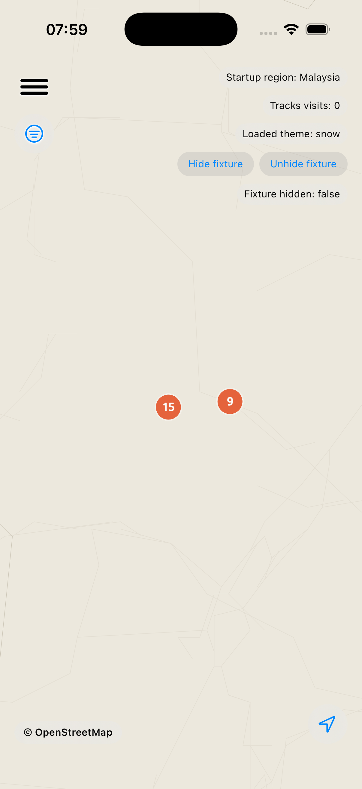
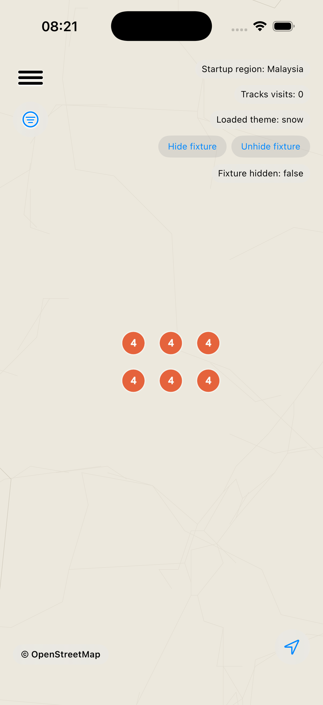
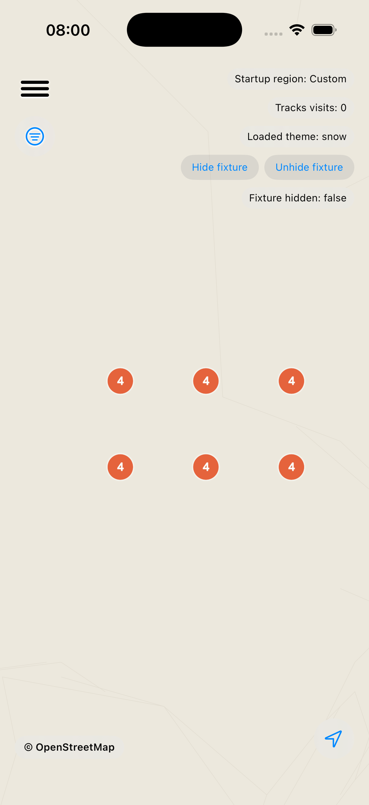
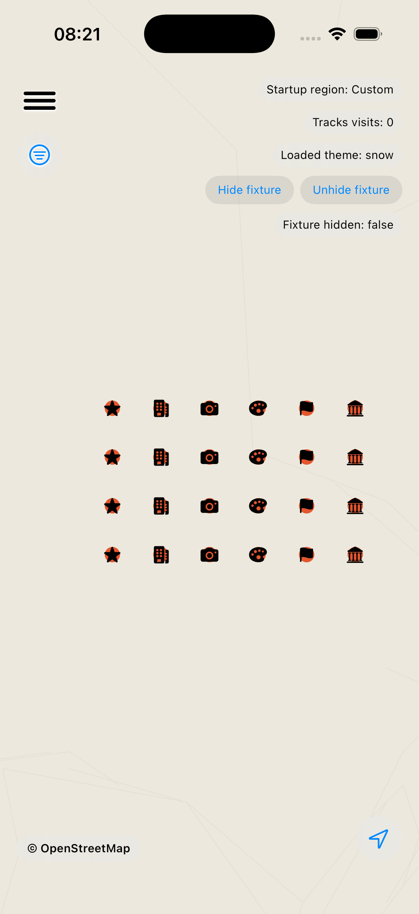

# WP-348 Cluster Tuning

Issue #348 asked whether the app-side clustering is tunable after device review found mid-zoom clusters too aggressive.

## Tunable Surface

- `PinLayers.baseClusterRadiusPoints` controls fallback render clustering distance.
- `PinLayers.maximumClusterZoom` controls the last zoom that can cluster.
- `MLNMapViewRepresentable.renderSnapshot(...)` passes both values into `PinClusterer.Options`.

## Proposed Value

Set `baseClusterRadiusPoints` from `44.0` to `20.0`; leave `maximumClusterZoom` unchanged at `PinFeatureFilter.streetZoom - 1` (`13`).

This keeps city zoom decluttering, but lets the default-pin-size dense KL fixture break out to individual pins at z13. Source-level regression coverage asserts the z12 source cluster shape (`[2, 4, 4, 4, 9]` plus one singleton) and z13 renders all 24 fixture places as singleton pins.

## Visual Comparison

| View | Current radius 44 | Proposed radius 20 |
| --- | --- | --- |
| KL z12 |  |  |
| KL z13 |  |  |

Observed dense KL fixture behavior:

- z12 current: 24 places collapsed to two bubbles (`15`, `9`).
- z12 proposed: 24 places represented as six smaller bubbles (`4` each).
- z13 current: 24 places remained clustered.
- z13 proposed: all 24 places render as individual pins.
