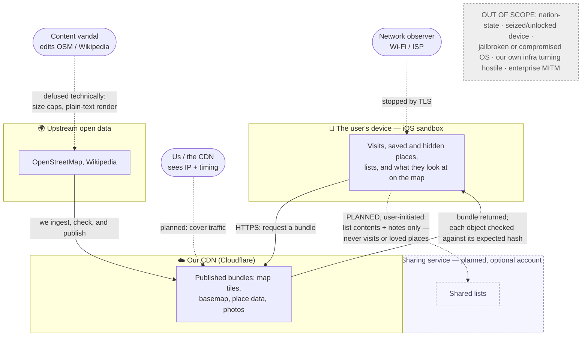

# Threat Model — Making Tracks

Making Tracks is a travel discovery-map app: the place data and maps come from open public sources and are
served from a CDN; everything a user does stays on their device; no account is required (one is optionally
available for sharing); and the app carries no third-party analytics, advertising, or tracking code. This
document says what the app defends against and what it does not, so security and privacy work stays
proportionate.

The exclusions (§4) are the important part. Most wasted security effort on an app like this goes into
defending against an attacker who has already broken the device or the operating system — at which point
nothing the app does can help. If a proposed defence does not answer a threat listed here, it does not
belong in the app. The calibration tests (§5) and the review rule (§6) are how we hold that line.

This is an engineering document, not the user-facing policy. The promises to users are in
[`privacy.md`](../privacy.md); this describes the attackers those promises assume.

## The model at a glance

## 1. What we protect, in order

1. **Where the user's interest lies.** What they look at on the map, what they download, and what they save
   or hide. Together this shows where someone is, is going, or cares about — the most sensitive thing the
   app touches. `privacy.md` promises this stays on the device and that we do not track where users are.
   Everything else is ranked against protecting it.
2. **Delivery integrity** — that the bytes a device renders are the bytes we published, with nothing
   changed in transit. This is handled: each tile and basemap object is named by its hash, and on download
   its content is checked against the expected hash listed in the manifest (`TileCodec.decode`, the
   [download safety contract](superpowers/plans/2026-07-18-wp-rm-region-manager.md) §8); an object that does
   not match is rejected. (The `manifest` that carries those hashes is fetched over TLS and schema-checked,
   not itself hash-addressed.) This proves an object is *what we published* — it does not prove the content
   is *safe to show*. Whether the content itself is safe is a separate in-scope threat (§2, hostile upstream
   content); the two are not the same thing.
3. **Staying up and staying affordable** — the CDN bill and availability. Open buckets invite scraping and
   cost-inflation (#142, anti-abuse auth, deferred). A normal operational concern, not a privacy one.

## 2. Attackers we defend against

- **A network observer** on shared Wi-Fi, an ISP, or a café router. TLS handles this: standard HTTPS
  through the device's trust store hides the request contents. We add nothing further here (§5 explains why
  we do not pin certificates).
- **Us, and the CDN itself.** We host on Cloudflare, which sees a device's IP address and the timing of its
  requests. `privacy.md` states plainly that this is not anonymous, that we do not log it (Cloudflare may),
  and that downloading a bundle does not reveal a visit. This is the one first-party watcher we plan around
  rather than simply trust. The mitigation — **cover traffic**, where the app quietly fetches a few extra
  areas so the pattern of downloads does not reveal the real one — is committed but not built yet.
  `privacy.md` says of it: *"We're still working out how, and we don't have it yet,"* and describes it as
  something the user will be able to choose. It follows the region-model design (#131) and a proposed
  amendment to the principles (P15) that is still under review; the size of the decoy budget is a policy
  question, not settled here. It is a planned control, not a shipped one.
- **A content vandal** editing the open sources we draw from. Our data comes from crowd-editable places
  (OpenStreetMap, Wikipedia). A bad edit — a hostile place name, a malicious image URL, an oversized
  description — is ingested and published, and it passes the hash check because it *is* what we published
  (delivery integrity, §1, proves delivery, not safety). This is the app's most likely attack, and it is
  already handled by the way we treat all source data as untrusted (PRINCIPLES §10; spec §5.5;
  `privacy.md`: *"a bad entry in a public database can't harm your phone"*): source text is decoded
  defensively with size and length limits, stripped with `SAFE_TEXT`, image URLs checked against an
  https-only host allowlist, and every source string shown as plain text — never as HTML, never built
  straight into a database query, a shell command, or a prompt. **Any review finding about handling
  untrusted content belongs here** (§6); it does not need to name a network attacker.

  To be clear about the limit: we defend against the **technical** consequences of a bad edit — safe
  plain-text rendering, no markup or script execution, length caps, hash-verified delivery. We do **not**
  promise to catch offensive or illegal *content itself*; there is no content-moderation system. A
  vandalized entry that is technically harmless will render until the next pipeline refresh re-ingests the
  upstream source and picks up its revert. The recourse is that refresh cadence, plus the user's ability to
  report a problem with a place (`privacy.md`), which a person reviews — not a real-time takedown.
- **Data brokers via third-party code.** The app ships **no third-party analytics, advertising, or tracking
  code, and makes no third-party network calls of its own** — this is a fixed rule (`privacy.md` principle
  3), and it is the single most effective privacy measure a consumer app can take. This is not the same as
  "no third-party code at all": the app does use third-party *libraries* for its core function (currently
  GRDB for the on-device database and MapLibre for drawing the map — current examples, not a fixed list),
  each pinned to a reviewed version. The rule is about behaviour, not authorship: adding anything that
  collects or sends usage data is a privacy change that needs a `privacy.md` amendment, not just a code
  review.

## 3. Trust boundaries

The diagram above is the whole picture. In words: the user's data lives inside the iOS sandbox on their
device. It leaves only over HTTPS, and only through the specific user-initiated actions `privacy.md`
already lists (share a list, report a place, opt-in place statistics). The device fetches published bundles
from the CDN and checks each object against its expected hash. The one outbound flow of a user's own data
is sharing a list (shown as *planned* in the diagram): with an optional account, a user can send a list —
its places and any notes they added — to people they choose. Even then, what travels is only that list and
its notes; a shared list never carries whether the user visited or loved a place. There is no server that
stores what a user does, because we never built one — the optional accounts system, when it exists, holds
only a sharing identity and the lists a user chose to share, never their visits or map history.

## 4. What is out of scope

These are chosen exclusions, and choosing them is good engineering. Each is excluded because the defence
would only matter *after* an attacker has already crossed a boundary they would have to cross to reach it,
or because it asks the app to solve something the app cannot. A review finding that assumes one of these is
overreach (§6).

- **A jailbroken, rooted, or otherwise compromised device or OS.** Once the platform sandbox is broken, any
  defence the app adds can be walked around. The iPhone sandbox is sufficient isolation; we rely on the OS
  security model rather than rebuild it. (This is why the on-device file-protection class is not worth
  worrying about — see §5.)
- **A seized, unlocked device and forensic extraction.** We store no account credentials and nothing at
  rest that ties data to a real identity; on-device data has the standard OS file protection, and we do not
  claim to withstand someone with the unlocked device in their hands.
- **A nation-state or well-resourced targeted attacker.** A consumer map app cannot claim to hold off an
  attacker with unlimited resources, and it should not pretend to. Trying to defend a tourist's map
  browsing against that attacker is the mistake this document exists to prevent; a user who genuinely faces
  it needs platform-level protection, not us.
- **Enterprise MITM / a custom root CA.** A device that has been configured to trust an attacker's
  certificate authority is already under someone else's administrative control; TLS is not expected to
  defend a device set up against its own user.

**Our own infrastructure** is a real risk, and it is *identified rather than ignored* — it is simply not
something the app's code can defend, so it is handled operationally (§7), not in the client.

## 5. How to tell a real control from overreach

Before proposing or accepting a security or privacy control, screen it against three questions:

1. **Has the attacker already won?** Would the control only help *after* an attacker crossed a boundary
   they would have to cross to reach it (the sandbox, the OS, the unlocked device)? If so, it is pointless
   — reject it.
2. **Is the attacker one we defend against?** Is it someone from §2 (network observer, us/the CDN, a
   content vandal, a would-be tracker), or someone from §4 (nation-state, seized device, broken OS)?
   Defend against the first list; document and accept the risk from the second.
3. **Does it cost more than it saves?** Would the control add more operational failure than the attack risk
   it removes? If so, reject it — this is exactly why we do not pin certificates.

**Recent decisions, as worked examples:**

- **Certificate pinning — not done, on purpose.** It fails the third test. Google, Apple, OWASP, and
  Cloudflare all advise against pinning for an app like this: certificates rotate, pinning causes outages,
  and it is easily bypassed on a compromised device — the only device where it would matter, which is
  already out of scope (§4). Certificate Transparency and short-lived certificates, provided by the
  platform, cover the residual risk.
- **Re-checking the origin after a redirect — kept.** Cheap and worthwhile: a background download can
  follow redirects without the app seeing them, so we re-check that a finished download's final origin is
  still `tiles.making-tracks.app` and that its content matches the object's expected hash (#197's
  `validateDownloadedFile`). Small, in scope, kept.
- **The on-device `.none` file-protection class — not an issue.** The only attacker it would help against
  is someone extracting files from the device, which is out of scope (§4), and the sensitive data is not
  tied to a real identity anyway. Not worth building; not a valid finding.

## 6. Using this document in review

Every security or privacy review finding must **name a specific in-scope attacker from this document**, or
**propose a change to the model**. A finding that names none — or that assumes an out-of-scope attacker
(§4) — is set aside as overreach. The same rule lives in `AGENTS.md`'s review gates (the §5.5
security-posture hook).

Findings about handling untrusted content — defensive parsing, size limits, `SAFE_TEXT`, plain-text
rendering, URL allowlists, avoiding unescaped queries — name the **content-vandal attacker (§2)**,
equivalently the untrusted-data posture (spec §5.5, PRINCIPLES §10). They never need a network attacker and
are never overreach: this is the app's most likely threat. The overreach rule is aimed at defences against
out-of-scope *attackers* (§4), not at the everyday handling of hostile content we publish.

The model is not fixed. If a genuine new attacker appears, the right move is to argue it into §2 or §4 here
— changes to this document are ratified the same way `privacy.md` is — not to slip it in as a one-off
review comment.

## 7. Pipeline and infrastructure

The risk to the pipeline and hosting is identified, and it is handled by standard operational procedure
rather than by anything in the app: strong credential management (ephemeral credentials where possible),
best-practice host configuration, signed commits, secrets kept out of files (via `op`), least privilege,
and timely patching. This is operational discipline, not an attack surface the app's code models.
